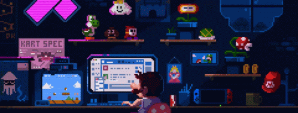

  

<!--

  <h1>Hi World! </h1>

-->
#

  

<!-- 

-->
## About Me
- I'm a **2nd-year Computer Science Ph.D. student** at North Carolina State University.
- My research areas include **Multiagent Systems**, **Natural Language Processing (NLP)**, and **Computational Linguistics**.
- I have a passion for **coding** and was an active **competitive programmer** during my undergraduate days.
- I’m currently looking for exciting **research internship opportunities in AI/ML for Summer 2025**.

#

  <h3> Thank you for visiting 😊</h3>
  

<!--
**fardinsaad/fardinsaad** is a ✨ _special_ ✨ repository because its `README.md` (this file) appears on your GitHub profile.

Here are some ideas to get you started:

- 🔭 I’m currently working on ...
- 🌱 I’m currently learning ...
- 👯 I’m looking to collaborate on ...
- 🤔 I’m looking for help with ...
- 💬 Ask me about ...
- 📫 How to reach me: ...
- 😄  Pronouns: ...
- ⚡ Fun fact: ...
-->
